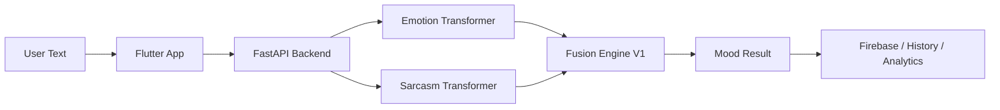

# MoodLens AI — Emotion, Sarcasm & Mood Intelligence App

[](#tech-stack)
[](#tech-stack)
[](#tech-stack)
[](#models)
[](#tech-stack)
[](#fusion-engine-v1)
[](#license)

MoodLens is an AI-powered mood intelligence app that analyzes user text with transformer-based emotion and sarcasm models, then applies a context-aware Fusion Engine V1 to produce final mood, sentiment, sarcasm, emotional trend, and per-statement insights.

It is built as a Flutter app backed by a FastAPI inference service. Firebase supports authentication, history, and analytics features, while Hugging Face hosts the private transformer model repositories used by the backend.

## Preview

Screenshots can be added under `docs/screenshots/`.

| Home | Results | Analytics | Profile |
|---|---|---|---|
| `docs/screenshots/home.png` | `docs/screenshots/result.png` | `docs/screenshots/analytics.png` | `docs/screenshots/profile.png` |

## Architecture



## Fusion Engine V1

Fusion Engine V1 is not a model-weight merge. It is an inference fusion layer that combines:

- raw emotion prediction
- raw sarcasm prediction
- context-aware sentence splitting
- sarcasm calibration
- emotion correction
- multi-line aggregation
- final mood score generation

This matters because sarcasm often creates a mismatch between surface wording and implied mood. For example, a positive phrase like "Great" can become negative when paired with a failed deployment, ignored message, surprise exam, or other negative context.

## Models

| Component | Details | Hugging Face Repo |
|---|---|---|
| Emotion Model | 12-class transformer classifier | `kpatel1607/moodlens-emotion-v2` |
| Sarcasm Model | Binary sarcasm classifier | `kpatel1607/moodlens-sarcasm-v4` |
| Fusion Config | Rule/config package for Fusion Engine V1 | `kpatel1607/moodlens-fusion-engine-v1` |

## Benchmark Results

| Component | Metric | Score |
|---|---:|---:|
| Fusion Engine V1 | Mood Accuracy | 90.91% |
| Fusion Engine V1 | Sarcasm Accuracy | 96.36% |
| Fusion Engine V1 | Fully Correct | 90.91% |

## Features

- Emotion detection
- Sarcasm detection
- Context-aware mood correction
- Multi-line text analysis
- Per-statement emotion breakdown
- Mood score generation
- Emotional trend detection
- User history
- Analytics dashboard
- Profile customization
- Firebase authentication
- Firestore-backed mood history and analytics
- Hugging Face model loading

## Example API Response

```json
{
  "overall": {
    "overall_mood": "Negative with Sarcasm",
    "mood_score": -48.97,
    "dominant_emotion": "annoyance",
    "sarcasm_count": 2,
    "uncertain_count": 0,
    "trend": ["negative", "sarcastic", "sarcastic"]
  },
  "statements": [
    {
      "text": "Great. Exactly what I needed.",
      "surface_emotion": "love",
      "sarcasm_label": "Likely Sarcastic",
      "primary_emotion": "annoyance",
      "sentiment": "Sarcastic / Negative"
    }
  ]
}
```

## Tech Stack

| Layer | Technologies |
|---|---|
| Frontend | Flutter, Dart |
| Backend | FastAPI, Python, Transformers, Hugging Face Hub, PyTorch |
| Database/Auth | Firebase Authentication, Cloud Firestore |
| Deployment | Hugging Face Spaces backend, Flutter app targets |

## Environment Variables

Backend model repositories are private, so `HF_TOKEN` must be configured with a Hugging Face read token in deployment environments.

```env
MOODLENS_EMOTION_MODEL_ID=kpatel1607/moodlens-emotion-v2
MOODLENS_SARCASM_MODEL_ID=kpatel1607/moodlens-sarcasm-v4
MOODLENS_FUSION_ENGINE_ID=kpatel1607/moodlens-fusion-engine-v1
MOODLENS_SARCASM_THRESHOLD=0.34
# SARCASM_THRESHOLD=0.34 is also accepted as a compatibility alias.
HF_TOKEN=your_huggingface_read_token
```

Firebase is used by the Flutter app. Do not commit Firebase Admin SDK private keys or service-account JSON files. For client Firebase setup, use your own generated Firebase client configuration files or FlutterFire configuration for:

```env
FIREBASE_PROJECT_ID=your_firebase_project_id
FIREBASE_WEB_API_KEY=your_firebase_web_api_key
FIREBASE_ANDROID_APP_ID=your_firebase_android_app_id
FIREBASE_IOS_APP_ID=your_firebase_ios_app_id
```

## Local Setup

### Backend

```bash
cd backend
python -m venv .venv
source .venv/bin/activate
pip install -r requirements.txt
uvicorn app.main:app --reload
```

On Windows:

```powershell
cd backend
python -m venv .venv
.venv\Scripts\activate
pip install -r requirements.txt
uvicorn app.main:app --reload
```

### Frontend

```bash
cd moodlens_app
flutter pub get
flutter run
```

## API Endpoints

These are the app-defined backend endpoints currently present:

| Method | Endpoint | Purpose |
|---|---|---|
| `GET` | `/` | Root status message |
| `GET` | `/routes` | Lists registered FastAPI routes |
| `POST` | `/analyze/single` | Analyze one text input as a single statement |
| `POST` | `/analyze/sequence` | Analyze text split into statements with full response |
| `POST` | `/analyze/sequence/compact` | Analyze text and return compact app-friendly response |

FastAPI also exposes generated API documentation at `/docs` when the backend is running.

Example request:

```bash
curl -X POST "http://127.0.0.1:8000/analyze/sequence/compact" \
  -H "Content-Type: application/json" \
  -d "{\"text\":\"Great, the app crashed during my final demo.\"}"
```

## Project Structure

```text
MoodLens/
├── backend/
│   ├── app/
│   ├── tests/
│   ├── Dockerfile
│   ├── Procfile
│   ├── README.md
│   ├── requirements.txt
│   └── run.py
├── docs/
│   ├── screenshots/
│   └── architecture.md
├── moodlens_app/
│   ├── android/
│   ├── ios/
│   ├── lib/
│   ├── macos/
│   ├── test/
│   ├── web/
│   ├── windows/
│   └── pubspec.yaml
├── reference_notebooks/
├── README.md
└── .gitignore
```

## Interview Talking Points

### Why two models were used instead of one

Emotion and sarcasm are related but different signals. A dedicated emotion classifier can focus on emotional categories, while a dedicated sarcasm classifier can detect when surface wording may not match the intended meaning.

### Why fusion logic is needed

Raw model outputs are useful, but user text often needs context. Fusion Engine V1 corrects cases where positive words appear in negative situations, where short phrases are ambiguous, or where multi-line context changes the interpretation.

### How sarcasm can invert surface sentiment

Sarcasm often uses positive wording to express frustration. In "Perfect, the deployment failed again," the word "Perfect" looks positive, but the event is negative. Fusion logic can invert the final mood toward annoyance or disappointment.

### How multi-line context improves accuracy

A single short sentence can be unclear. Multi-line analysis tracks previous negative context, weights strong sarcastic statements, and aggregates statement-level mood into a more realistic overall result.

### How Hugging Face deployment makes the backend lightweight

The backend loads model repositories from Hugging Face instead of storing large model weights in Git. This keeps the repository cleaner and makes deployment easier to update as models improve.

### What I would improve next

- collect real user feedback
- train a small fusion classifier
- improve multilingual support
- add privacy-preserving analytics
- deploy scalable inference

## Limitations

- Short phrases like "Nice" or "Fine" can be ambiguous.
- Sarcasm without context is hard to detect reliably.
- Model predictions are probabilistic and can be wrong.
- MoodLens is not a mental health diagnosis tool.

## Future Improvements

- Real user feedback loop
- Personal mood trend analytics
- Multilingual emotion support
- On-device lightweight model
- Fine-tuned fusion classifier
- Better benchmark dataset

## License

License: Not specified yet.
