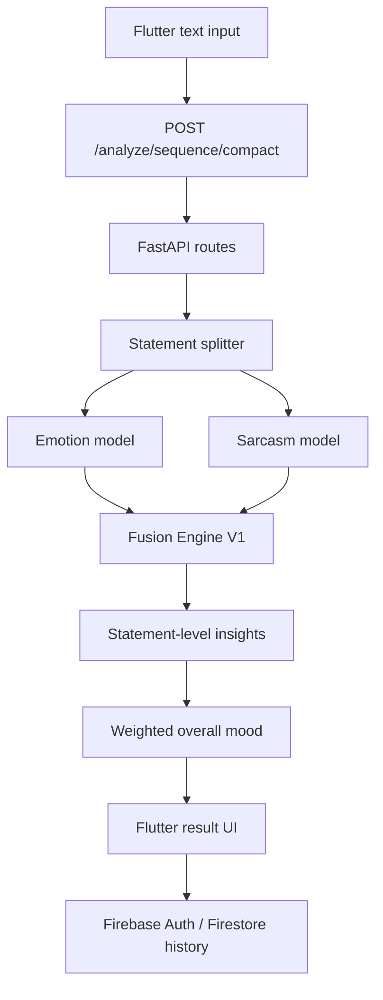

# MoodLens Architecture

MoodLens combines a Flutter client, a FastAPI inference backend, Firebase user services, and private Hugging Face model repositories.

## Backend Responsibilities

- Load private Hugging Face emotion and sarcasm models with `HF_TOKEN`.
- Split user text into statements.
- Run emotion and sarcasm inference.
- Apply Fusion Engine V1 correction rules.
- Return compact or full analysis responses.

## Frontend Responsibilities

- Collect user text.
- Call the FastAPI backend.
- Render mood summary, per-statement analysis, and timelines.
- Store user history and analytics through Firebase-backed services.

## Deployment Notes

The backend is Docker-ready and configured for Hugging Face Spaces-style deployment on port `7860`. Large model weights are intentionally kept outside Git and loaded from Hugging Face repos at runtime.
